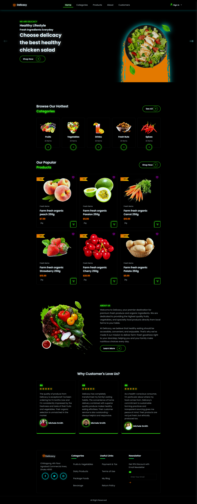

# 🌟 Delicacy - Fruits & Vegetables E-commerce Website

Welcome to **Delicacy**, a modern e-commerce website for fresh fruits and vegetables with a stunning dark mode neon theme. This project showcases a responsive design with interactive elements, smooth animations, and a futuristic cyberpunk aesthetic.



## 🚀 Features

### Core Functionality
- **Responsive Design**: Fully optimized for desktop, tablet, and mobile devices
- **Dark Mode Neon Theme**: Striking black background with vibrant neon accents
- **Interactive Elements**: Hover effects, transitions, and micro-interactions
- **E-commerce Components**: Product listings, categories, pricing, and discount badges

### Website Sections
1. **Navigation Bar**
   - Logo with basket icon
   - Menu items (Home, Categories, Products, About, Customers)
   - Sign-in button with user icon

2. **Hero Section**
   - Swiper carousel with 3 promotional slides
   - Animated text with neon glow effects
   - Call-to-action buttons with gradient fills

3. **Categories Section**
   - 5 product categories (Fruits, Vegetables, Drinks, Fresh Nuts, Spices)
   - Hover animations with neon borders
   - Item count indicators

4. **Products Section**
   - 6 featured products with images
   - Pricing with discount badges
   - Cart and wishlist icons
   - Hover effects with top border animation

5. **About Section**
   - Company introduction
   - Mission statement
   - Call-to-action button

6. **Customer Reviews**
   - 3 customer testimonials
   - Star ratings
   - Customer profiles with avatars

7. **Footer**
   - Company information
   - Quick links
   - Newsletter subscription
   - Social media icons

### Authentication Pages
- **Sign In Page**: Email/password login with social options
- **Register Page**: Account creation with terms acceptance

## 🎨 Design System

### Color Palette
- **Background**: Pure Black (#000000)
- **Neon Accents**:
  - Green: `#39ff14`
  - Blue: `#00ffff`
  - Pink: `#ff00ff`
  - Orange: `#ff6600`
  - Purple: `#bf00ff`
- **Text**:
  - Primary: White (#ffffff)
  - Secondary: Light Gray (#b0b0b0)

### Typography
- **Font**: Poppins (200-900 weights)
- **Headings**: Bold with neon glow
- **Body**: Clean and readable

## 🛠️ Technologies Used

### Frontend
- **HTML5**: Semantic markup
- **CSS3**: Advanced styling with custom properties
- **JavaScript**: Interactive functionality
- **Swiper.js**: Carousel/slider functionality
- **Boxicons**: Icon library

### Responsive Design
- **Mobile-First Approach**: Breakpoints at 1080px, 991px, 852px, 712px, 642px, 546px, 370px
- **Flexbox & Grid**: Modern layout techniques
- **Media Queries**: Adaptive styling for all devices

## 📁 Project Structure

```
delicacy/
├── index.html          # Main website
├── signin.html         # Sign in page
├── register.html       # Registration page
├── style.css          # Main stylesheet
├── main.js            # JavaScript functionality
└── img/               # Image assets
    ├── amazon_logo.png
    ├── background.png
    ├── home1.png
    ├── home2.png
    ├── home3.png
    ├── cate1.png through cate5.png
    ├── p1.png through p6.png
    ├── about.png
    ├── c1.jpg through c3.jpg
    ├── profile.jpg
    └── right-arrow.png, left-arrow.png
```

## 🚀 Getting Started

### Prerequisites
- Modern web browser (Chrome, Firefox, Safari, Edge)
- Basic knowledge of HTML, CSS, and JavaScript

### Installation
1. Clone the repository:
   ```bash
   git clone https://github.com/yourusername/delicacy.git
   ```
2. Navigate to the project directory:
   ```bash
   cd delicacy
   ```
3. Open `index.html` in your browser

### Customization
- **Images**: Replace placeholder images in the `img/` directory
- **Colors**: Modify CSS variables in `:root` section of `style.css`
- **Content**: Update text content in HTML files
- **Products**: Add/remove product items in the products section

## 📱 Responsive Breakpoints

| Device Type | Width Range | Key Features |
|-------------|-------------|--------------|
| Desktop | >1080px | Full layout with all elements |
| Tablet | 991px - 1080px | Adjusted padding and spacing |
| Mobile | 852px - 991px | Collapsible navigation menu |
| Small Mobile | 712px - 852px | Simplified layout |
| Extra Small | <712px | Stacked elements, reduced text size |

## 🎯 Browser Compatibility

- Chrome (latest)
- Firefox (latest)
- Safari (latest)
- Edge (latest)
- Mobile browsers (iOS Safari, Chrome for Android)

## 🔧 Future Enhancements

1. **Shopping Cart Functionality**
   - Add to cart with persistent storage
   - Cart quantity management
   - Checkout process

2. **Product Filtering & Search**
   - Category filtering
   - Price range filtering
   - Search functionality

3. **User Accounts**
   - User dashboard
   - Order history
   - Wishlist management

4. **Payment Integration**
   - Stripe integration
   - Multiple payment methods

5. **Admin Panel**
   - Product management
   - Order management
   - Analytics dashboard

**Built with ❤️ by Noshin Nawar**

